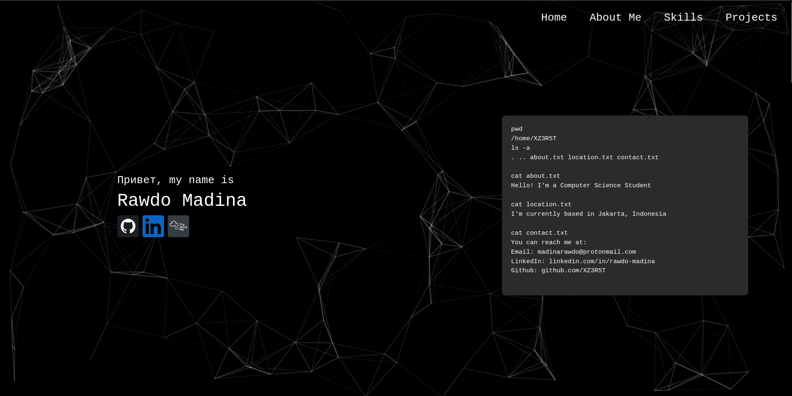
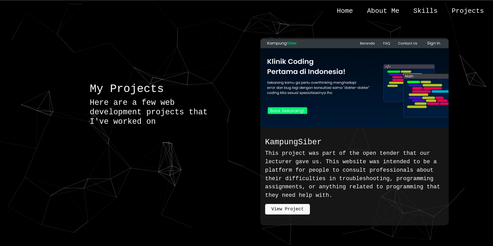

# My Portfolio Website

Welcome to my portfolio website! This project showcases my work, skills, and projects I've worked on.

## Web Link

https://xz3r5t.github.io/My-Portfolio/

## Description

This portfolio website is a single-page application that highlights my interests. It includes sections for my bio, skills, projects, and contact information.

## Installation

To run this project locally, follow these steps:

1. Clone the repository:
    ```sh
    git clone https://github.com/XZ3R5T/My-Portfolio.git
    ```
2. Navigate to the project directory:
    ```sh
    cd My-Portfolio
    ```
3. Preferably use Live Server extension to host my web on your local machine!

## Usage

Open the website in your browser to view the portfolio. Navigate through different sections using the navigation bar.

## Screenshots




## Technologies Used

- HTML
- CSS
- JavaScript
- Bootstrap 

## Contact

As this project is still in progress if you have any suggestions, questions, or feedbacks, feel free to reach out to me at:
- Email: madinarawdo@protonmail.com

